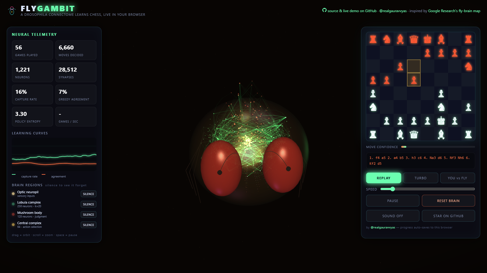
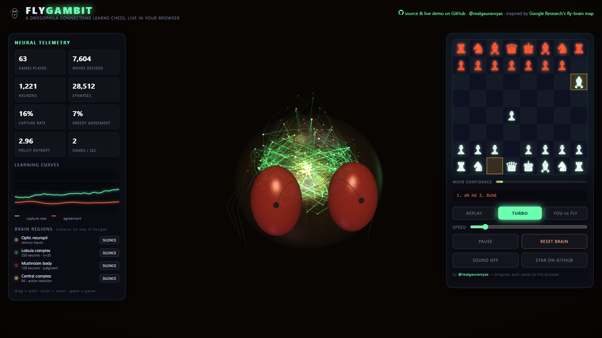
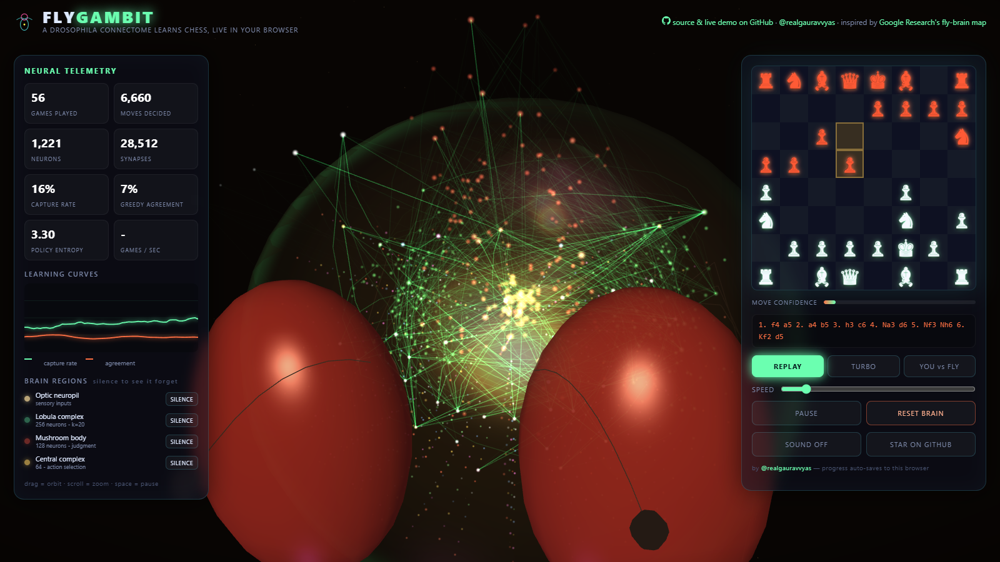
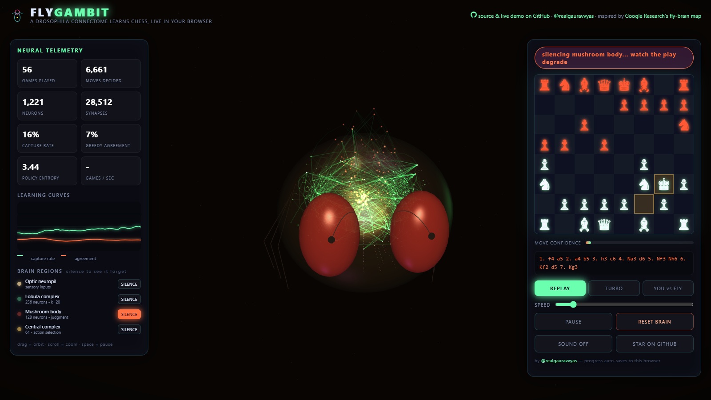

# FlyGambit

**A fruit fly learns chess — live in your browser, and you can watch every synapse fire.**

Nobody is teaching a *fly* chess. Everyone taught a neural net to play chess. This teaches a
sparse, connectome-constrained artificial brain — modeled on the anatomy of the male
*Drosophila* brain mapped in [Google Research's connectomics milestone][blog] — and renders the
actual brain doing the thinking: ~1.2k neurons, ~28k synapses, all inside a glowing 3D fly
that flaps, bobs and plays material.

> **No server. No pretrained weights. No Python.** The learning happens in your tab, in real
> time. Refresh and the fly still remembers its games (localStorage).

| **REPLAY** — every move pulses the live synapses | **TURBO** — full-speed training behind a showcase game |
|:--:|:--:|
|  |  |
| **MACRO** — GFP-green lobula, tdTomato-red mushroom body, gold central complex | **LESION** — silence a region and watch play collapse |
|  |  |

**▶ Try it: [realgauravvyas.github.io/fly-gambit](https://realgauravvyas.github.io/fly-gambit/)**

[blog]: https://research.google/blog/a-connectomics-milestone-mapping-the-complete-male-fruit-fly-brain/

---

## What you can do

| Mode | What happens |
|---|---|
| **REPLAY** | One self-play game at watchable speed. Each move pulses the real activations of the network — optic → lobula → mushroom body → central complex. |
| **TURBO** | Training games run at full speed invisibly while one showcase game plays out at watchable pace. Watch the learning curves (capture rate + agreement with a greedy-capture baseline) climb. |
| **YOU vs FLY** | You play white, the fly plays black — and it *learns from your games too*, including the ones you win. |
| **SOUND** | Procedurally synthesized (WebAudio, zero audio files): synaptic blips per piece type, thumps on captures, arpeggios on mate, descending zaps when you silence a region. |

## Visual identity

FlyGambit is the companion to [AFTERWING][afterwing], another fly-connectome project by the
same author — and it is deliberately the *other* kind of fly. AFTERWING is a jewel-toned
creature (iridescent teal, violet bands, lilac wings) wandering an arena. FlyGambit is a
**specimen under a fluorescence microscope**: amber-black background, GFP-green lobula,
tdTomato-red mushroom body, gold central complex, honey chitin. One is a living insect,
the other is a labelled brain doing science.

[afterwing]: https://github.com/realgauravvyas/afterwing

## The thing nobody else did: brain lesions

Each panel on the left is a **silenceable brain region**, borrowed from real Drosophila
connectome anatomy:

| Artificial region | Real fly region | Chess role |
|---|---|---|
| Optic neuropil (773) | retina / lamina / medulla | the 8x8 board, 12 piece-planes |
| Lobula complex (256, k=20) | lobula plate | tactical feature extraction |
| Mushroom body (128, k=20) | alpha/beta lobes | position judgment (value baseline) |
| Central complex (64) | ellipsoid body | action selection |

Hit **SILENCE** on the mushroom body mid-game and watch the fly forget how to judge a
position; silence the central complex and it moves at random. It's a playable homage to
the activation/silencing experiments that the connectomics field is *actually* used for.

## Live demo

**https://realgauravvyas.github.io/fly-gambit/**

Local dev (ES modules need any static server; double-clicking `index.html` won't work):
`python -m http.server 8000` → http://localhost:8000

## How it learns (honestly, it's not magic)

- **Network** (`js/connectome.js`, ~300 LOC, pure JS/typed arrays): sparse fan-in layers
  (20 synapses per neuron, random-but-fixed wiring — like a connectome, unlike a dense MLP)
  trained with **REINFORCE + a learned value baseline**, Adam, one step per self-play game.
- **Reward**: +1/-1 checkmate, +1/-1 material swings discounted over the game (capture
  shaping), 0 draw. The fly doesn't know piece names — only which squares have stuff on them.
- **Self-play** (`js/chessai.js`): one network plays both colors (color = an input bit), so
  it's its own league table.
- **Training games**: at turbo speed you'll see meaningful capture-rate improvement in ~1–2
  minutes. It's a fly, not Stockfish: by ~1000 games it reliably stops hanging pieces to
  one-move captures and starts hunting them.

## Repo layout

```
fly-gambit/
├── index.html              the whole app shell
├── css/style.css           neon glass HUD
├── js/
│   ├── connectome.js       the fly brain: sparse layers, REINFORCE, Adam   (DOM-free)
│   ├── chessai.js          self-play loop, features, training, evaluation  (DOM-free)
│   ├── brain-viz.js        three.js: fly body + firing neurons + axons     (window.THREE)
│   ├── chart.js            learning-curve sparkline                        (DOM-free)
│   └── main.js             glue: modes, board, lesions, autosave
├── vendor/
│   ├── three.min.js        three.js r128 (MIT)
│   └── chess.mjs           chess.js 1.0 (BSD-2)
├── test/smoke.mjs          node test: runs 100 self-play games, asserts learning
└── assets/favicon.svg
```

## Tests

```bash
node test/smoke.mjs
# capture rate first25: 0.143  next75: 0.189
# PASS: fly is learning to capture
```

The test asserts: no NaN in weights after 100 games, softmax normalizes, capture rate
improves over training, and fly-vs-greedy-bot evaluation works.

## Credits

- Sound is fully procedural (oscillators + filtered noise), no assets.\n- Inspired by *A connectomics milestone: mapping the complete male fruit fly brain*
  (Google Research, 2024) and FlyWire (Jovcevic et al., *Nature* 2024).
- The 3D fly is a procedural stylized *Drosophila* built in three.js — not a scan.
- Sibling project: [FlySprint](https://github.com/realgauravvyas/fly-sprint) — the same
  connectome universe, with 1–5 flies whose running gaits are evolved by a genetic
  algorithm and raced over 100 m / 200 m / 400 m / hurdles.
- three.js (MIT), chess.js  (BSD-2).
- Built as a single static page; zero build step, zero dependencies to install.

## Notes & limitations

- It's 1.2k neurons against FlyWire's ~100k — the *anatomy* is the homage, not the scale.
- Training is on-policy REINFORCE: noisy by design, and it forgets when you reset.
- Safari: works, but WebGL additive-blend line performance drops below the first two Chrome modes.
